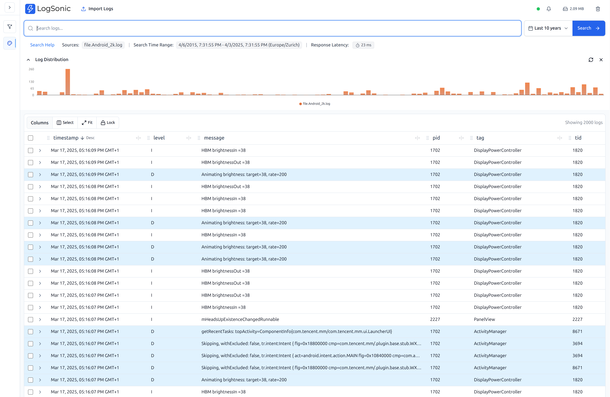

# LogSonic

LogSonic is a Desktop-First Log Analysis Application designed to be minimal, simple and fast. While there are plenty of cloud-based log analysis tools, most of them are not designed specifically for distribution and ease of use and on local computer. LogSonic takes the local use-first approach seriously, with a single binary installation of less than 10MB that serves a feature-rich UI in your local browser. The log ingestion wizard automatically recognizes well known log patterns and search experience is blazing fast, delightful and intuitive.



## Features

- **Desktop-First**: Designed specifically for local log analysis
- **Minimal**: Single binary installation for Windows, Mac, and Linux. Run inside Docker, if you wish to. 
- **Simple**: Easy-to-use web UI running on your local browser
- **Fast**: Optimized for searching through large log files
- **Offline Analysis**: No internet dependency, all data stays on your machine, debug while you travel.
- **Multiple Log Formats**: Automatic recognition and ingestion of logs from various formats (Syslog, Apache, Nginx) based on grok pattern. 
- **Customizable**: Ability to filter and color log lines based on cotents, choose fields to display. 
- **Advanced Search**: Comprehensive search capabilities through the web UI. Search highlighting, Complex queries with AND OR NOT logical operationsetc. 
- **Visualization**: Built-in tools for visualizing log data patterns
- **Extensible**: Well documented [OpenAPI interface](#api-documentation) to ingest logs from your own scripts or tools. 

## Installation

### Pre-built Binary

1. Download the latest LogSonic binary for your platform from the [GitHub releases page](https://github.com/logsonic/logsonic/releases).
2. Make the binary executable (Linux/Mac only):
   ```bash
   chmod +x logsonic
   ```
3. Run the binary (prefer to run from console to see errors etc.):
   ```bash
   ./logsonic
   ```

> **Note**: On MacOS, unsigned download binaries are not allowed to run by default. In order to run the downloaded binary, open System Preferences, choose the Security control panel, select the General tab. Look for the message: "logSonic was blocked from opening because it is not from an identified developer." Click the Open Anyway button to the right of the message. Alternatively, you could build the binary yourself as per steps below or build the Docker image. 


4. Open your browser and navigate to `http://localhost:8080`

If the port 8080 is not available in your system, you could choose another port to to run by command line option `-port 8088`
   ```bash
   ./logsonic -port 8088
   ```

Looking for some sample logs to try? [LogHub](https://github.com/logpai/loghub/) repository has some great collection such as this [Apache log](https://github.com/logpai/loghub/blob/master/Apache/Apache_2k.log)
Download the log to you local computer and import using Import File menu. 

### Build from Source

#### Prerequisites
- Go 1.23.6 or later
- Node.js 20 or later
- npm

#### Steps
1. Clone the repository:
   ```bash
   git clone https://github.com/logsonic/logsonic.git
   cd logsonic
   ```

2. Build the frontend:
   ```bash
   cd frontend
   npm ci
   npm run build
   npm run build:copy
   cd ..
   ```

3. Build the backend:
   ```bash
   cd backend
   go mod download
   go build -o logsonic .
   ```

4. Run the binary:
   ```bash
   ./logsonic
   ```

### Docker Image

1. Build the Docker image:
   ```bash
   docker buildx build -t logsonic .
   ```

2. Run the container:
   ```bash
   docker run -p 8080:8080 -v /path/to/logs:/data logsonic
   ```

## Configuration Options

LogSonic can be configured using command line flags or environment variables:

### Command Line Flags
- `-host`: Host address to bind to (default: localhost)
- `-port`: Port to listen on (default: 8080)
- `-storage`: Path to storage directory for indices (default: system-specific)
- `-help`: Show usage information

### Environment Variables
- `HOST`: Host address to bind to
- `PORT`: Port to listen on
- `STORAGE_PATH`: Path to storage directory

### Examples
```bash
# Basic usage with defaults
logsonic

# Custom host and port
logsonic -host 0.0.0.0 -port 9000

# Custom storage path
logsonic -storage /var/logs/storage

# Using environment variables
HOST=0.0.0.0 PORT=9000 STORAGE_PATH=/var/logs/storage logsonic
```

## Getting Started

### Log Ingestion

1. Start LogSonic and open the web UI in your browser at http://localhost:8080
2. Click on "Import Log File" button in the UI
3. Select your log file and choose the appropriate format
4. If your log format is not automatically detected, you can specify a custom Grok pattern
5. Once imported, the log file will be indexed and available for searching

### Search and Analysis

1. Use the search bar at the top to filter logs by time range and keywords
2. The left panel provides field-based filtering options
3. Use the advanced search syntax for more complex queries
4. Create custom filters and save them for future use

## Development Environment

### Frontend

The frontend is built with React, TypeScript, and Vite:

In development setup, we run the UI on port 8081 while the backend is running on 8080

```bash
cd frontend
npm ci
PORT=8081 npm run dev
```

### Backend

The backend is written in Go:

```bash
cd backend
# If using air for hot reloading
./scripts/dev.sh

# Or standard Go run
go run main.go
```
Open http://localhost:8081 in your browser for local development 


## Architecture

LogSonic uses a client-server architecture:

- **Backend**: Go server that handles log ingestion, parsing, and indexing
- **Frontend**: React SPA that provides the user interface
- **Storage**: Local file-based storage for indices and metadata

See [Architecture Documentation](docs/Architecture.md) for more details.


### API Documentation

LogSonic provides a Swagger UI for exploring and testing the API. Once the application is running, you can access the Swagger documentation at:

```
http://localhost:8080/api/v1/swagger/index.html
```

To regenerate the Swagger documentation after making changes to the API, run:

```bash
cd backend
# Install swag if not already installed
go install github.com/swaggo/swag/cmd/swag@latest

# Generate swagger docs
swag init -g pkg/server/server.go
```


## FAQ

### How does LogSonic handle large log files?

LogSonic uses efficient indexing techniques to handle large log files. The backend uses the Bleve search library to create optimized indices, allowing for fast search even with gigabytes of logs.

### Can I use custom log formats?

Yes, LogSonic supports custom Grok patterns for parsing log files. You can define your own patterns if your log format is not automatically detected.

### Is my data sent to any servers?

No, LogSonic is completely offline. All data remains on your machine, and no internet connection is required after installation.

## Support

For issues, feature requests, or questions, please create an issue on the [GitHub repository](https://github.com/logsonic/logsonic/issues).

## License

LogSonic is released under the [MIT License](LICENSE).
