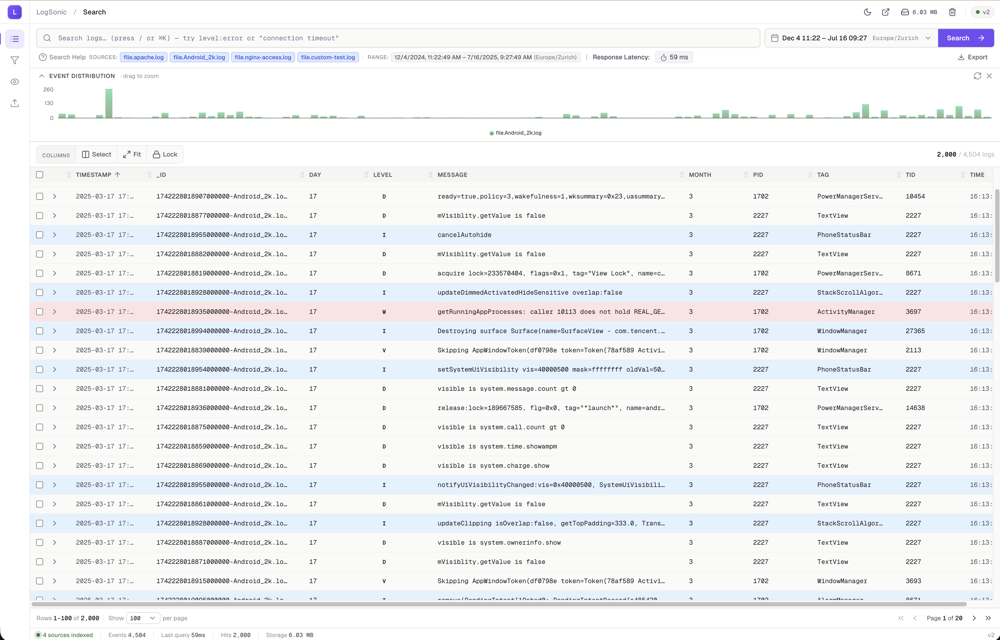
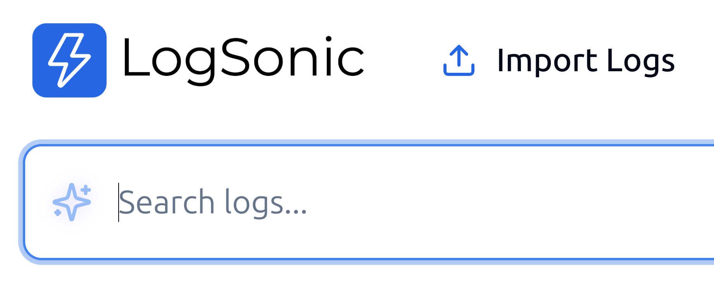

# LogSonic

LogSonic is a Desktop-First Log Analytics application which runs on Windows, Mac and Linux. It runs fully offline with no external dependencies. It installs as a single self-contained binary that serves a feature-rich User interface in your local browser. The log ingestion wizard supports importing local log files (single or many at once) and automatically recognises well-known log patterns to tokenise the contents. The log search experience is blazing fast, delightful and intuitive.

It also ships an MCP server extension so you can analyse logs with machine intelligence.



## Features

- **v2 redesigned UI** — left-rail navigation, dark/light themes, resizable panels, sticky source tabs, in-row field extraction, and a status bar that reports source count, events, last-query latency, and storage in real time.
- **log2grok auto-detection** — the import wizard runs the [log2grok](https://github.com/logsonic/log2grok) library across two stages (curated library of 100+ known patterns, then drain-based clustering for unknown formats) and surfaces the best match with a coverage score before you import. Custom patterns are saved to disk and re-used on later imports.
- **Multi-file import** — drop multiple files at once; LogSonic detects each format independently, lets you confirm or override per-file, then imports them in one batch.
- **Smart timestamp resolution** — derives a real wall-clock time per line even when the format omits the year or timezone, with overrides (anchor, year strategy, forced timezone, rollover detection) surfaced in the wizard. See [Timestamp Resolution](#timestamp-resolution) below.
- **MCP server** — the LogSonic [MCP server](/mcp/README.md) connects with Claude Desktop, Cursor, Windsurf, and any other MCP client.
- **Optional AI query assistant** — when a [local Ollama model](#bleve-search-query-assistance) is running, a sparkles button next to the search bar translates plain English into Bleve query syntax. The button is hidden when Ollama is not detected.
- **Desktop-first & offline** — single binary for Windows, Mac, and Linux (or run in Docker). No telemetry, no network calls, all data stays on your machine.
- **Advanced search** — Bleve-backed full-text search with highlighting, field-shorthand (`level:error`, `status:>400`, `_id:`), regex (`/regex/`), exclude (`-excluded`), boolean operators, and saved filter combinations.
- **Color rules** — highlight rows by field/value or substring; default rules pre-loaded for `level:error`, `level:warning`, etc., editable in the side panel.
- **Event distribution chart** — drag-to-zoom histogram of events over time, broken down by source.
- **Extensible** — documented [OpenAPI interface](#api-documentation) for ingesting from your own scripts or tools.

## Installation

### Pre-built Binary

1. Download the latest LogSonic binary for your platform from the [GitHub releases page](https://github.com/logsonic/logsonic/releases).
2. Make the binary executable (Linux/Mac only):
   ```bash
   chmod +x logsonic
   ```
3. Run the binary (prefer to run from console to see errors etc.):
   ```bash
   ./logsonic
   ```

> **Note**: On MacOS, unsigned download binaries are not allowed to run by default. In order to run the downloaded binary, open System Preferences, choose the Security control panel, select the General tab. Look for the message: "logSonic was blocked from opening because it is not from an identified developer." Click the Open Anyway button to the right of the message. 

> On Windows: You may need to enable "Run this Application Anyway" while running the executeable. 

Alternatively, you could build the binary yourself as per steps below or build the Docker image. 


4. Open your browser and navigate to `http://localhost:8080`

If the port 8080 is not available in your system, you could choose another port to to run by command line option `-port 8088`
   ```bash
   ./logsonic -port 8088
   ```

Looking for some sample logs to try? [LogHub](https://github.com/logpai/loghub/) repository has some great collection such as this [Apache log](https://github.com/logpai/loghub/blob/master/Apache/Apache_2k.log)
Download the log to you local computer and import using Import File menu. 

### Enabling AI Assistance

Logsonic supports Model Context Protocol. To install Logsonic MCP server, use the instructions in  [MCP server](/mcp/README.md)

### Bleve Search Query assistance



Since bleve query syntax may be confusing for beginners, Logsonic has a feature which converts simple english queries to bleve search syntax. This is available in the release 0.5 onwards. Logsonic will automatically detect and enable AI assistance features if a local Ollama instance is running with the predefined logsonic image. Follow the [instructions](https://github.com/logsonic/logsonic/blob/main/ollama/README.md) to build your local [Modelfile](https://github.com/logsonic/logsonic/blob/main/ollama/Modelfile)

### Build from Source

#### Prerequisites
- Go 1.25.7 or later
- Node.js 20 or later
- npm

#### Steps
1. Clone the repository:
   ```bash
   git clone https://github.com/logsonic/logsonic.git
   cd logsonic
   ```

2. Build the frontend (the resulting `dist/` is embedded into the Go binary):
   ```bash
   cd frontend
   npm ci
   npm run build
   npm run build:copy
   cd ..
   ```

3. Build the backend:
   ```bash
   cd backend
   go mod download
   go build -o logsonic .
   ```

4. Run the binary:
   ```bash
   ./logsonic
   ```

### Docker Image

1. Build the Docker image:
   ```bash
   docker buildx build -t logsonic .
   ```

2. Run the container:
   ```bash
   docker run -p 8080:8080 -v /path/to/logs:/data logsonic
   ```

## Configuration Options

LogSonic can be configured using command line flags or environment variables:

### Command Line Flags
- `-host`: Host address to bind to (default: localhost)
- `-port`: Port to listen on (default: 8080)
- `-storage`: Path to storage directory for indices (default: system-specific)
- `-help`: Show usage information

### Environment Variables
- `HOST`: Host address to bind to
- `PORT`: Port to listen on
- `STORAGE_PATH`: Path to storage directory

### Examples
```bash
# Basic usage with defaults
logsonic

# Custom host and port
logsonic -host 0.0.0.0 -port 9000

# Custom storage path
logsonic -storage /var/logs/storage

# Using environment variables
HOST=0.0.0.0 PORT=9000 STORAGE_PATH=/var/logs/storage logsonic
```

## Getting Started

### Log Ingestion

1. Start LogSonic and open the web UI in your browser at http://localhost:8080
2. Click the **Import** button in the left rail
3. Drop one or many `.log` / `.txt` / `.json` files into the **Upload Log File** picker
4. LogSonic auto-detects the format for each file using log2grok. If detection succeeds you'll see a green **Pattern found** badge with a coverage score; otherwise you can paste a custom Grok pattern and **Test** it inline against a sample of the file
5. Confirm the timestamp resolution (see below) and click **Import**. Files are indexed in parallel and become searchable as soon as ingestion completes

### Timestamp Resolution

LogSonic resolves a real wall-clock timestamp for every log line, even when the line itself doesn't carry a complete date. The resolver runs automatically during import and surfaces a diagnostic in step 3 of the wizard so you can confirm or override what it deduced before the file is indexed.

#### What the resolver auto-detects

The grok pattern emits a set of *captures* per line. The resolver looks at the canonical timestamp captures and composes a `time.Time` from whatever is available, in this priority order:

| What the line carries | Example | What the resolver does |
|---|---|---|
| Full year-qualified timestamp | `2015-10-18 18:01:47,978` (Hadoop), `01/Apr/2026:00:00:56 +0000` (nginx) | Parses directly. No inference needed. |
| Components with 4-digit year | `date=20171223 hour=22 minute=15` (HealthApp) | Composes from atomic fields. |
| Components with 2-digit year | `year=17 month=06 day=09 time=20:10:40` (Spark) | Expands the century against the **anchor** so `17` becomes `2017` rather than `1917` or `2117`. |
| Year-less timestamp | `Jun 14 15:16:01` (syslog, openssh, mac-system) | Borrows the year from the **anchor**. Detects Dec→Jan rollover when it sees the date jump backwards. |
| Time-only continuation lines | `20:10:41` after a fully-stamped line | Carries the prior line's date forward. Detects 23:59→00:00 rollover. |
| Nothing recognisable | bare app messages with no time fields | Falls back to the anchor; the import wizard flags the file with a red **Missing** chip so you can intervene before importing. |

The **anchor** is the absolute reference the resolver uses to fill in missing components. It's chosen automatically:

1. Source file's modification time (when LogSonic knows it — local file imports).
2. The first fully-qualified timestamp seen in the sample.
3. Wall-clock now (last resort — the wizard flags this as `synthetic`).

The import wizard previews each row's resolved timestamp with a confidence label (`exact`, `inferred`, `carried`, `synthetic`) so you can verify before ingesting. The confidence is shown in the preview only — it isn't persisted with the indexed log record.

#### When to override

The wizard's "Timestamp Resolution" panel auto-expands when something is ambiguous. Override it when:

- **The file's modification time isn't representative of its content** (e.g., you copied the file last week but it's from 2017). Pick `Custom date` for the anchor and enter a date inside the file's actual range.
- **The file has 2-digit years and the anchor isn't close in time** to the log content. The default century-expansion picks the most recent century that doesn't go into the future relative to the anchor; setting an explicit anchor in the right decade fixes mis-expansions.
- **The logs are in a non-UTC timezone but don't carry an offset.** Use `Force Timezone` to pin the source-side zone (`America/Los_Angeles`, `Asia/Kolkata`, etc.). This is interpretation, not display — search and the histogram still render in your browser's local time.
- **You know the year a year-less file came from.** Set `Force Year`. By default this *fills* missing values only — it won't overwrite a year the line already carries. Switch to `Overwrite` mode if you need the legacy behaviour where the override wins regardless.
- **A multi-day file spans a Dec→Jan boundary** and rollover detection guesses wrong. You can disable rollover and rely on a forced year instead.

The panel shows a live preview of the first few resolved lines as you change knobs, so you can confirm the result before clicking **Start Ingest**. Once confirmed, the configuration is sent with the ingest request and applied to every line in the file (and saved alongside any pattern you persist).

#### CLI / API users

When ingesting via the API directly, pass:

- `source_mtime` (RFC3339) on `/ingest/start` to anchor against the file's modification time.
- `timestamp_config` on `/ingest/start` with the full resolution: `{ anchor, year_strategy, forced_year, timezone, rollover, force_mode }`.

Without either, the resolver derives sensible defaults from the sample. The legacy `force_start_year` / `force_start_month` / `force_start_day` / `force_timezone` fields still work and are translated to a resolution with `force_mode=overwrite` to preserve their original semantics.

### Search and Analysis

1. Use the search bar at the top to filter logs by time range and keywords
2. The left panel provides field-based filtering options
3. Use the advanced search syntax for more complex queries
4. Create custom filters and save them for future use

## Development Environment

For development and testing always run the backend and frontend as **separate** processes — the embedded build (`build:copy` + single binary) is only meant for releases. The frontend in dev mode talks to the backend at `http://localhost:8080` directly via CORS.

### Backend (port 8080)

Go 1.25.7+. If you don't have air installed, you can install it for hot reload:
```bash
go install github.com/air-verse/air@latest
```

```bash
cd backend
# Hot-reloading dev (uses air)
./scripts/dev.sh

# Or standard Go run
go run main.go -port 8080
```

### Frontend (port 8081)

React 18 + TypeScript + Vite + Zustand + Radix UI + Tailwind. Vite defaults to 8080, so override the port to keep the backend port free:

```bash
cd frontend
npm ci
PORT=8081 npm run dev
```

Open http://localhost:8081 in your browser. The frontend hot-reloads on change.

### Running Tests

#### Backend Tests

```bash
cd backend
go test ./... -v
```

To run tests for a specific package:

```bash
go test ./pkg/storage/ -v
go test ./pkg/tokenizer/ -v
go test ./pkg/server/handlers/ -v
```

#### Frontend Tests

```bash
cd frontend
npm run test
```

To run tests with coverage report:

```bash
cd frontend
npx vitest run --coverage
```

#### E2E Tests

```bash
cd frontend
node e2e-test.mjs
node e2e-comprehensive.mjs
```

By default the browser runs headless. Pass `--headed` to open a visible browser window:

```bash
node e2e-test.mjs --headed
node e2e-comprehensive.mjs --headed
```

## Architecture

LogSonic uses a client-server architecture:

- **Backend**: Go server (chi router) that handles log ingestion, parsing, and indexing. Pattern detection is delegated to [log2grok](https://github.com/logsonic/log2grok) (curated library + drain clustering); search and storage are backed by [Bleve](https://github.com/blevesearch/bleve).
- **Frontend**: React 18 SPA (TypeScript, Vite, Zustand, Radix UI, Tailwind, Recharts). In release builds, the compiled `dist/` is embedded into the Go binary via `go:embed` and served from the same port.
- **Storage**: Local file-based Bleve indices under `~/.logsonic` (or `-storage` path). One index per day, with a side-file recording per-pattern timestamp resolution config.
- **Optional integrations**: Local Ollama for the AI query assistant; LogSonic MCP server for AI clients (Claude Desktop, Cursor, Windsurf).

See [Architecture Documentation](docs/Architecture.md) for more details.


### API Documentation

LogSonic provides a Swagger UI for exploring and testing the API. Once the application is running, you can access the Swagger documentation at:

```
http://localhost:8080/api/v1/swagger/index.html
```

To regenerate the Swagger documentation after making changes to the API, run:

```bash
cd backend
# Install swag if not already installed
go install github.com/swaggo/swag/cmd/swag@latest

# Generate swagger docs
swag init -g pkg/server/server.go
```


## FAQ

### How does LogSonic handle large log files?

LogSonic uses efficient indexing techniques to handle large log files. The backend uses the Bleve search library to create optimized indices, allowing for fast search even with gigabytes of logs.

### Can I use custom log formats?

Yes, LogSonic supports custom Grok patterns for parsing log files. You can define your own patterns if your log format is not automatically detected.

### Is my data sent to any servers?

No, LogSonic is completely offline. All data remains on your machine, and no internet connection is required after installation.

## Support

For issues, feature requests, or questions, please create an issue on the [GitHub repository](https://github.com/logsonic/logsonic/issues).

## License

LogSonic is released under the [MIT License](LICENSE).
