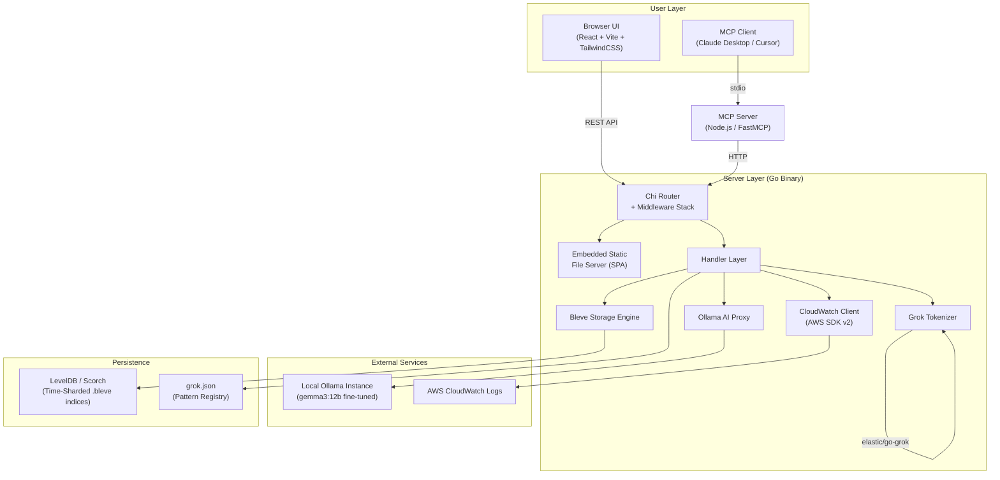
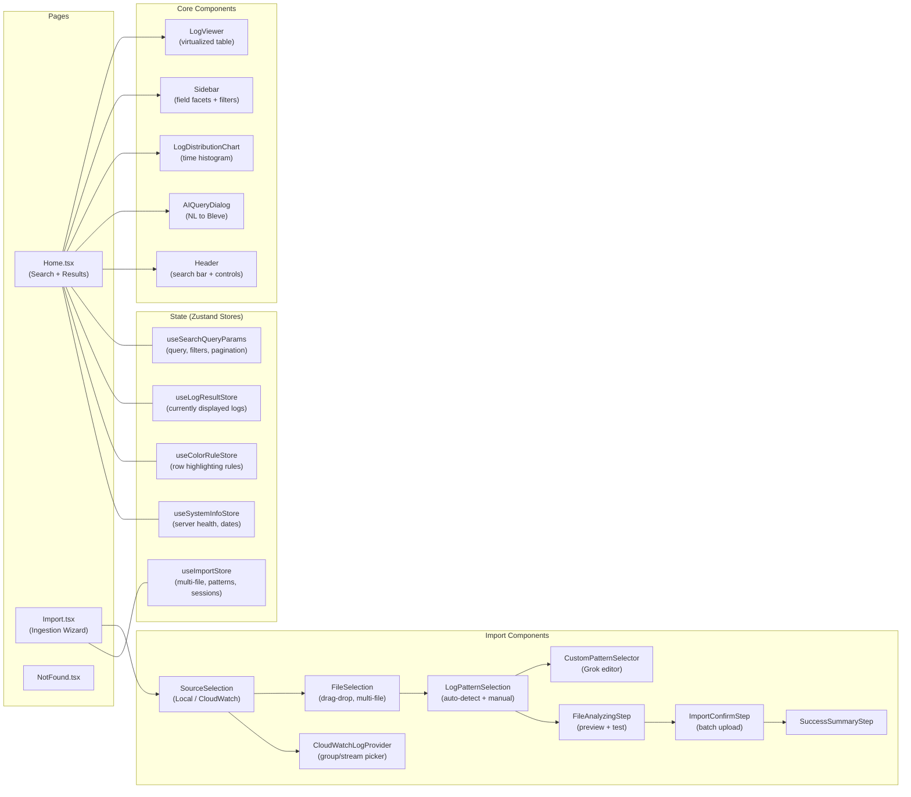
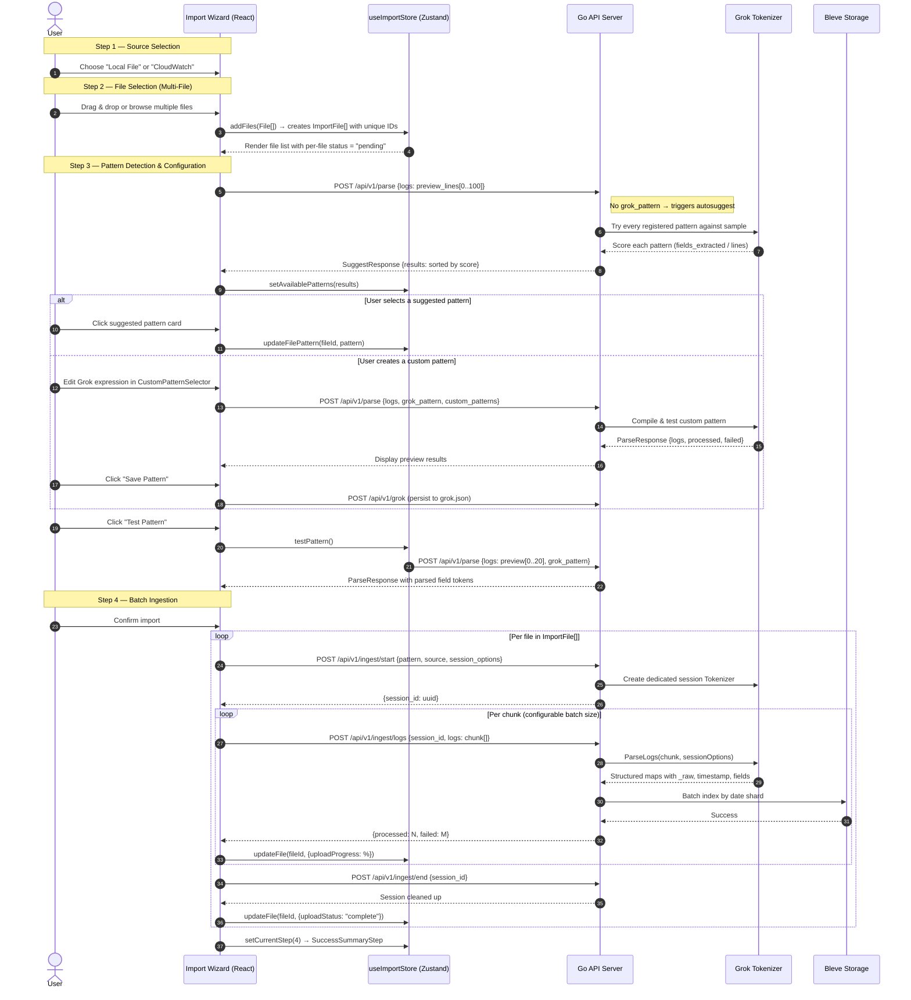
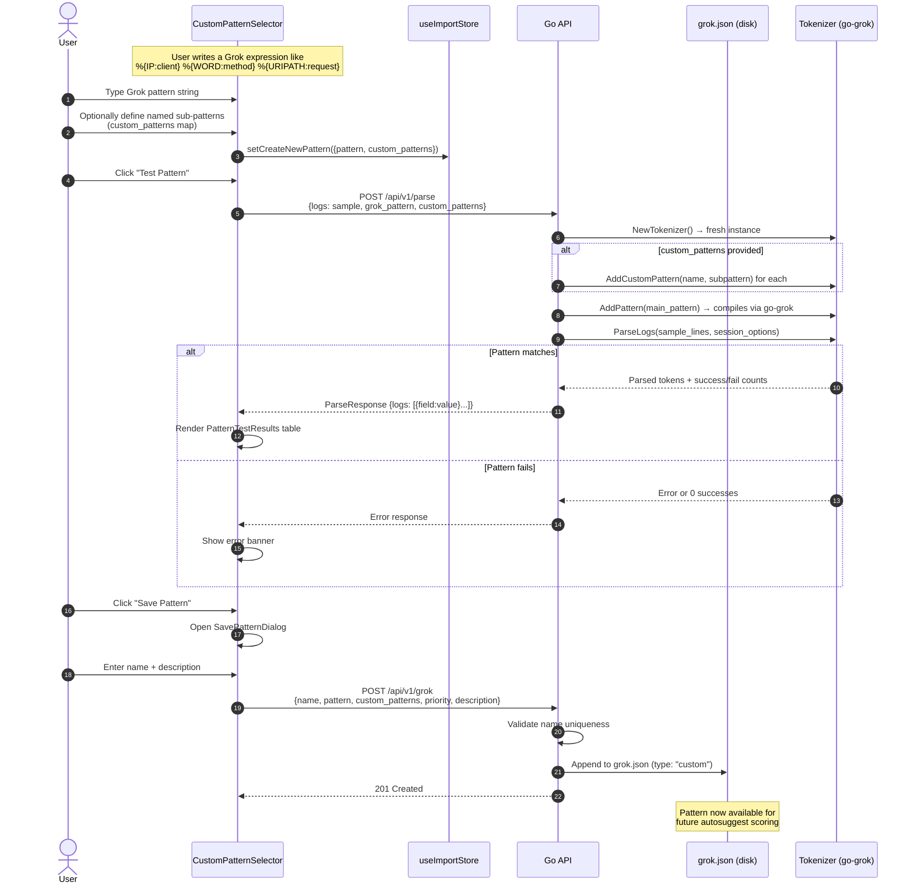
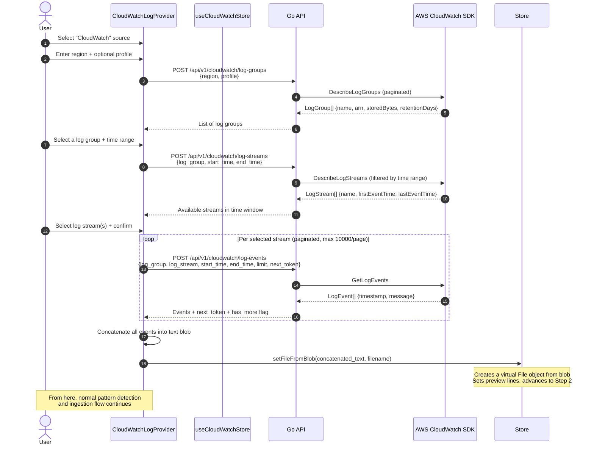
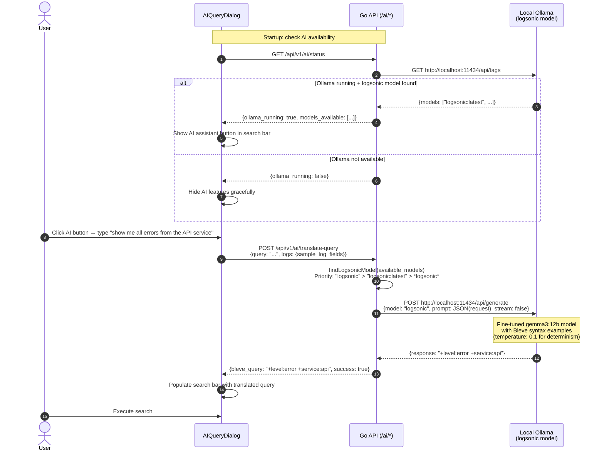
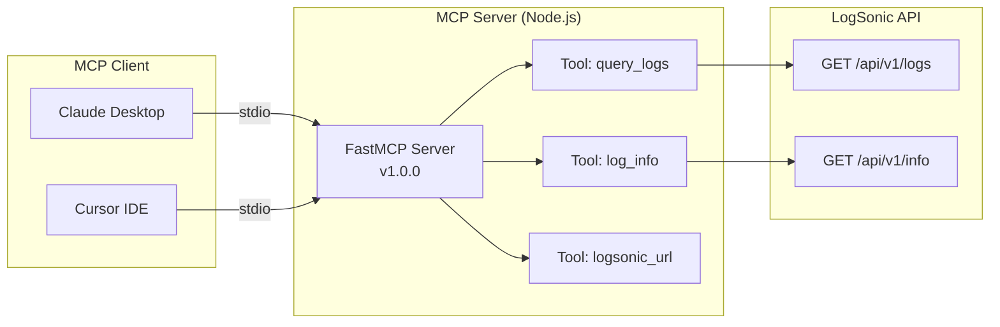
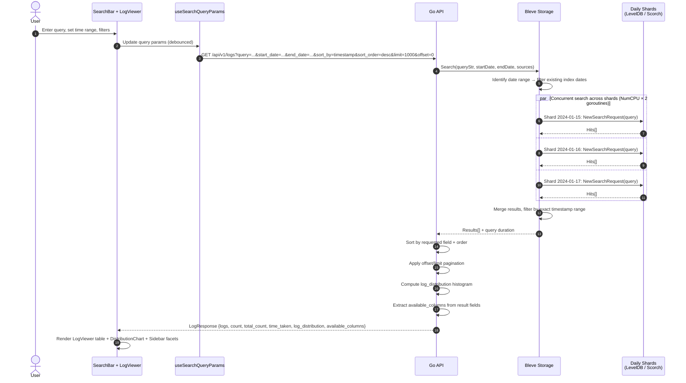
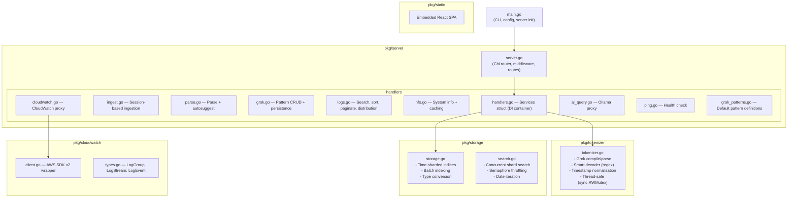
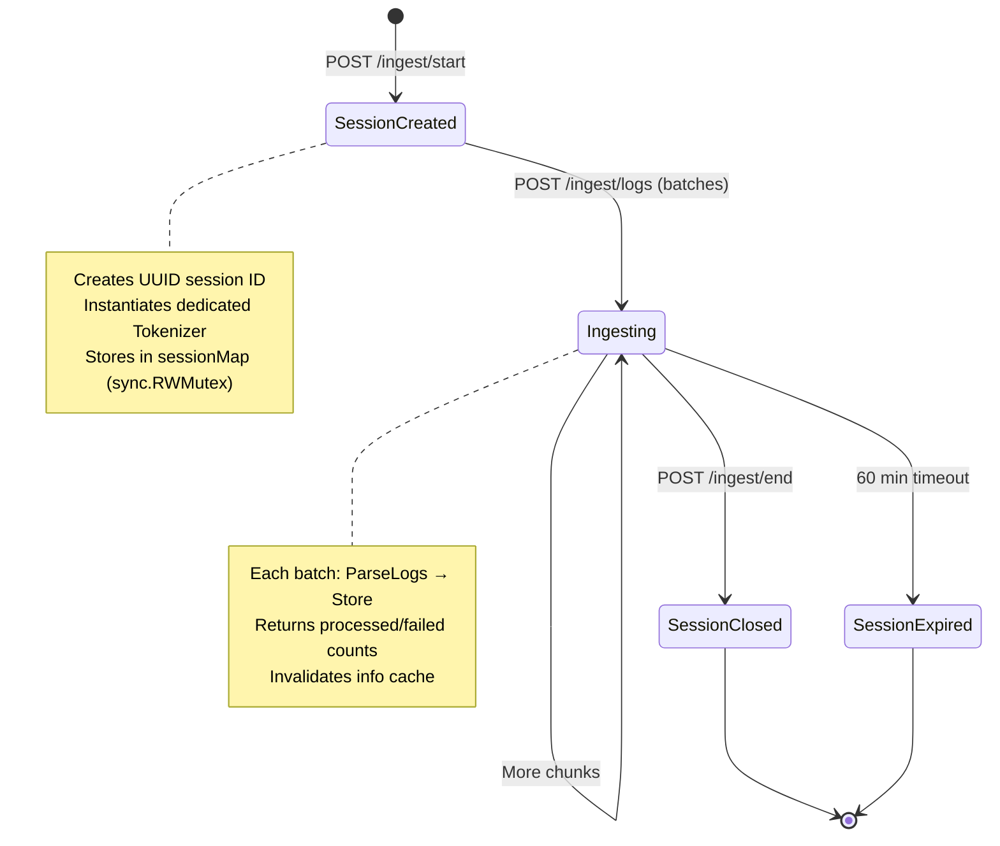

# LogSonic — System Architecture Documentation

## 1. Executive Summary

LogSonic is an offline-first, desktop log analytics tool built as a single Go binary (~10 MB) that embeds a React SPA frontend. It ingests logs from local files or AWS CloudWatch, parses them with Grok patterns, indexes them in time-sharded Bleve indices, and provides full-text search with visualization. Optional AI assistance (via local Ollama) translates natural language queries into Bleve syntax, and an MCP server extension allows external AI agents to query logs programmatically.

---

## 2. High-Level Component Architecture



---

## 3. Frontend Architecture



### Key Frontend Concepts

| Concept | Implementation | Notes |
|---|---|---|
| **State Management** | Zustand (non-persisted stores) | Atomic stores prevent cross-feature re-renders |
| **Styling** | TailwindCSS + PostCSS | Utility-first with custom config |
| **Bundler** | Vite (React + TypeScript) | Hot-reload dev on `:8081`, production embedded in Go binary |
| **Multi-File** | `ImportFile[]` array in `useImportStore` | Each file tracks its own pattern, status, and progress independently |
| **API Layer** | `lib/api-client.ts` + `lib/api-types.ts` | Typed fetch wrappers with shared response types |

---

## 4. Multi-File Import Flow

The import wizard supports selecting multiple local files simultaneously, each with independent pattern detection and upload tracking.



### Multi-File State Model

Each file in the `files: ImportFile[]` array carries its own lifecycle state:

```
ImportFile {
  id: string                    // Unique ID (file-{timestamp}-{counter})
  file: File                    // Browser File handle
  fileName: string
  fileSize: number
  previewLines: string[]        // First ~100 lines for pattern detection
  approxLines: number
  
  // Pattern Configuration (per-file)
  detectedPattern: Pattern | null
  selectedPattern: Pattern | null
  isCustomPattern: boolean
  customPattern: Pattern | null
  customPatternTokens: Record<string, string>
  
  // Detection State
  detectionStatus: 'pending' | 'detecting' | 'detected' | 'error'
  detectionError: string | null
  
  // Upload State
  uploadStatus: 'pending' | 'uploading' | 'complete' | 'error'
  uploadProgress: number        // 0..100
  uploadError: string | null
  totalLinesProcessed: number
  
  // Per-file session options
  sessionOptions: FileSessionOptions {
    smartDecoder: boolean       // Auto-detect IPs, emails, UUIDs
    timezone: string            // Force timezone override
    year/month/day: string      // Force date component overrides
  }
}
```

---

## 5. Custom Grok Pattern Lifecycle

Grok patterns are central to LogSonic's ability to parse arbitrary log formats. The system manages both built-in and user-defined ("custom") patterns.



### Pattern Storage Architecture

```
grok.json
├── patterns[]
│   ├── {name: "SYSLOG_RFC3164", pattern: "%{...}", type: "standard", priority: 10}
│   ├── {name: "APACHE_COMBINED", pattern: "%{...}", type: "standard", priority: 8}
│   ├── {name: "NGINX_ACCESS",   pattern: "%{...}", type: "standard", priority: 8}
│   └── {name: "My Custom Log",  pattern: "%{...}", type: "custom",   priority: 0,
│         custom_patterns: {"MYTOKEN": "[A-Z]{3}-\\d+"}}
```

**Key behaviors:**
- **Autosuggest** creates a _fresh_ `Tokenizer` per pattern to test. Each candidate pattern is compiled, run against the sample lines, and scored by `fields_extracted / total_lines`.
- **Session Tokenizer**: When ingestion starts (`/ingest/start`), a dedicated `Tokenizer` instance is created and stored in the `sessionMap` keyed by UUID. This isolates concurrent ingestion sessions.
- **Pattern Priority**: Patterns are sorted by priority (descending) during `preparePatterns()`. The first pattern to successfully match a line wins.
- **Smart Decoder**: An optional post-parse pass extracts IPs, emails, URLs, MACs, and UUIDs using compiled regexes, adding them as `_ipv4_addr`, `_email_addr`, etc.

---

## 6. CloudWatch Import Flow

LogSonic can pull logs from AWS CloudWatch (region/profile auto-detected from local AWS CLI config).



### CloudWatch Client Architecture

The CloudWatch client (`pkg/cloudwatch/client.go`) wraps the AWS SDK v2:

| Method | AWS API | Pagination | Notes |
|---|---|---|---|
| `ListLogGroups` | `DescribeLogGroups` | Token-based (all pages) | Returns all groups in account |
| `ListLogStreams` | `DescribeLogStreams` | Token-based, time-filtered | Filters by `firstEventTime`/`lastEventTime` overlap |
| `GetLogEvents` | `GetLogEvents` | Forward token, configurable `limit` (default 10000) | Returns `hasMore` flag based on token equality + result count |

**Metadata tagging**: CloudWatch-sourced logs carry metadata fields (`aws_region`, `log_group`, `log_stream`) injected via `IngestSessionOptions.Meta`, which are indexed as regular Bleve fields for filtered search.

---

## 7. AI Assistance Architecture

LogSonic offers two independent AI integration paths:

### 7a. Ollama Query Translation (Inline)

Built into the search UI for users who find Bleve query syntax difficult.



#### Ollama Model Design

The custom Ollama model (`ollama/Modelfile`) is built on `gemma3:12b` with:
- **System prompt**: Detailed Bleve syntax rules (boolean operators, wildcards, regex, escaping, numeric ranges)
- **Few-shot examples**: 20+ training pairs mapping natural language → Bleve queries
- **Low temperature** (0.1): Minimizes creativity, maximizes syntax precision
- **Model selection**: `findLogsonicModel()` searches available models for name containing "logsonic"

### 7b. MCP Server (External Agent Integration)

A standalone Node.js process using the `FastMCP` framework, communicating over `stdio`.



| MCP Tool | LogSonic API | Description |
|---|---|---|
| `query_logs` | `GET /api/v1/logs` | Full search with query, time range, pagination, source filter. Embeds Bleve syntax documentation in tool description. |
| `log_info` | `GET /api/v1/info` | Returns available dates, sources, storage stats. Strips `system_info` for conciseness. |
| `logsonic_url` | (generates URL) | Constructs a browser-openable URL with query params pre-filled |

**Configuration**: `LOGSONIC_HOST` and `LOGSONIC_PORT` env vars (defaults: `localhost:8080`).

---

## 8. Search & Query Execution



### Client-Side vs Server-Side Operations

| Operation | Where | Mechanism |
|---|---|---|
| Text search | Server (Bleve) | `QueryStringQuery` with full Bleve syntax |
| Time range filter | Server | Date-shard selection + post-filter on timestamps |
| Source filter | Server | Conjunction query on `_src` field |
| Field facet filtering | Client | Post-query filtering on rendered results |
| Color rule highlighting | Client | `useColorRuleStore` regex/contains rules |
| Column visibility | Client | Toggle which fields render in LogViewer |
| Sort | Server | Applied after merge, before pagination |
| Pagination | Server | offset/limit slicing |

---

## 9. Backend Package Architecture



### Middleware Stack (in order)

1. `RequestID` — Unique ID per request
2. `RealIP` — Extracts client IP from proxy headers
3. **Custom Logger** — Skips `/api/v1/ping` logging to reduce noise
4. `Recoverer` — Catches panics, returns 500
5. `Timeout(60s)` — Request deadline
6. `ThrottleBacklog(10, 50, 5s)` — Rate limiting: 10 concurrent, 50 queued, 5s queue timeout
7. **Security Headers** — `X-Content-Type-Options`, `X-Frame-Options`, `X-XSS-Protection`, `Referrer-Policy`
8. **CORS** — Restricted to `localhost:*` and `127.0.0.1:*`

---

## 10. Storage Engine Deep Dive

### Time-Sharding Strategy

```
.logsonic/
├── grok.json                    # Pattern registry
├── logs-2024-01-15.bleve/       # One Bleve index per calendar day
│   └── store/                   # LevelDB (Scorch engine)
├── logs-2024-01-16.bleve/
└── logs-2024-01-17.bleve/
```

### Index Mapping Configuration

| Field | Type | Indexed | Stored | Term Vectors | Notes |
|---|---|---|---|---|---|
| `timestamp` | DateTime | ❌ | ✅ | ❌ | Stored for retrieval, not search-indexed (date filtering is shard-based) |
| `_raw` | Text (standard analyzer) | ✅ | ✅ | ❌ | Full log text for fallback search. `IncludeInAll = true` |
| Dynamic fields | Text (standard analyzer) | ✅ (IndexDynamic) | ✅ (StoreDynamic) | ❌ | All Grok-extracted fields |

### LevelDB Tuning

```go
kvConfig := map[string]interface{}{
    "block_size":                32768,     // 32KB (better compression ratio)
    "write_buffer_size":         16777216,  // 16MB (better batching)
    "lru_cache_capacity":        33554432,  // 32MB LRU cache
    "bloom_filter_bits_per_key": 15,        // Bloom filter for read perf
    "compression":               "snappy",  // Fast compression
}
```

### Document ID Scheme

```
{unix_nanosecond_timestamp}-{source_filename}-{line_index}
```

Example: `1705320000000000000-access.log-42`

---

## 11. Ingest Session Architecture

Ingestion uses a session model to isolate concurrent uploads and maintain per-session tokenizer state.



**Key design decisions:**
- Each session gets its **own Tokenizer instance** so concurrent ingests with different patterns don't interfere
- Sessions have a **60-minute timeout** constant (though cleanup is currently manual via `/ingest/end`)
- The session map uses `sync.RWMutex` for safe concurrent access
- After each successful ingest batch, the **info cache is invalidated** to ensure fresh stats

---

## 12. Core Concepts & Design Decisions

### Time-Sharded Indices
By creating one `.bleve` index per calendar day, the system:
- Bounds memory usage per search window
- Makes deleting old data cheap (drop index directory)
- Enables parallel search across shards
- Naturally partitions write load

### Grok Pattern Priority System
Patterns are sorted by priority (highest first). When parsing a log line, the **first successful match wins**. This prevents expensive multi-pattern evaluation and gives user-defined patterns precedence over defaults.

### Smart Decoder
A post-parse enrichment step that uses compiled regexes to detect and extract:
- IPv4 addresses → `_ipv4_addr`
- Email addresses → `_email_addr`
- URLs → `_urls`
- MAC addresses → `_mac_addr`
- UUIDs → `_uuids`

These are prefixed with `_` to distinguish from Grok-extracted fields.

### Embedded SPA Architecture
The production Go binary embeds the entire React build output via `embed.FS`. The server handles SPA routing by serving `index.html` for any non-API, extensionless path (client-side routing support).

### Synchronous Ingestion
The current REST ingestion parses logs synchronously on the HTTP goroutine. This simplifies the architecture but couples HTTP request latency with CPU-bound Grok parsing, placing backpressure directly on the client.

### Offline-First AI
The Ollama integration is designed to degrade gracefully. The status check at startup determines feature availability, and its absence is Never an error — the AI button simply doesn't appear.
