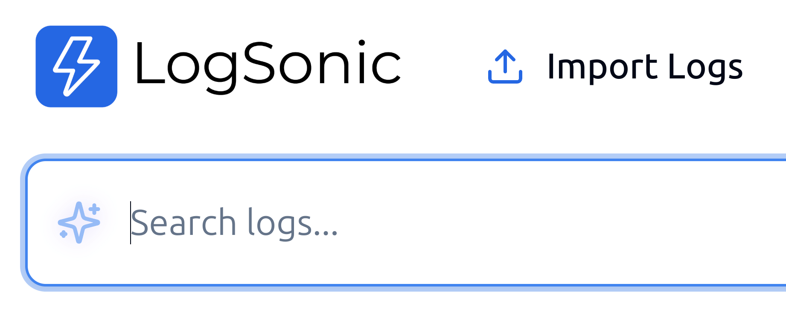

# How to use local Ollama Model with logsonic

## Install Ollama in your desktop. 

https://ollama.com/download

Make sure you have the latest version of Ollama installed in your desktop. 


## Build the fine tuned Model

```
cd ollama
ollama create logsonic -f Modelfile
```

> This is still a work in progress. We use gemma:12b model as a base and fine tune with system prompt and example. 


## Setup Ollama to automatically serve the model through API

If Ollama is not automatically running in background by default, manually start the model by 

```
ollama serve

```

Ensure the model is available with Ollama by 

```
curl http://localhost:11434/api/tags

```
This should output `{"models":[{"name":"logsonic:latest","model":"logsonic:latest",..... `

Start logsonic as usual. As soon as it starts, it automatically detects a running Logsonic model and UI will be enabled to use it for search query assistance. Click on the pulsating star icon to open AI assitant prompt. 


